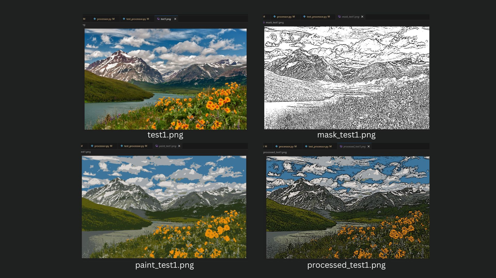
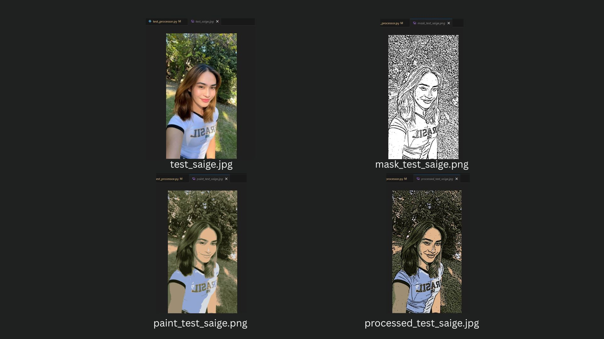
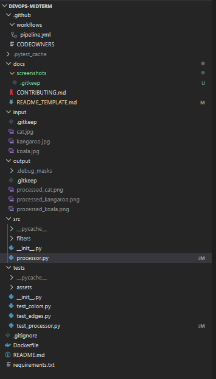
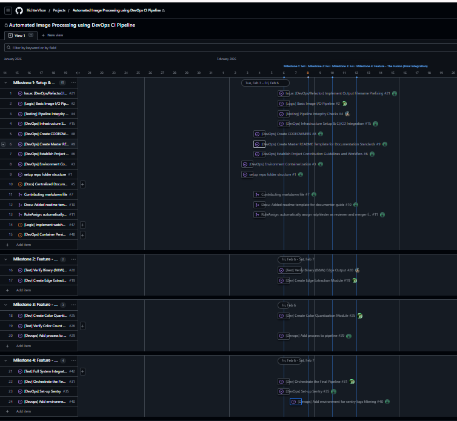
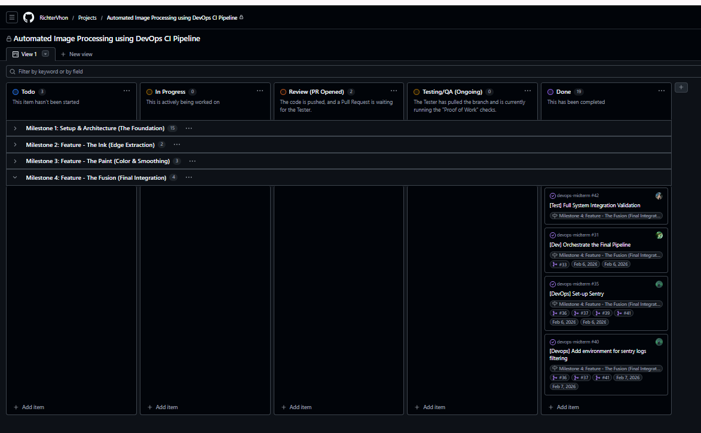
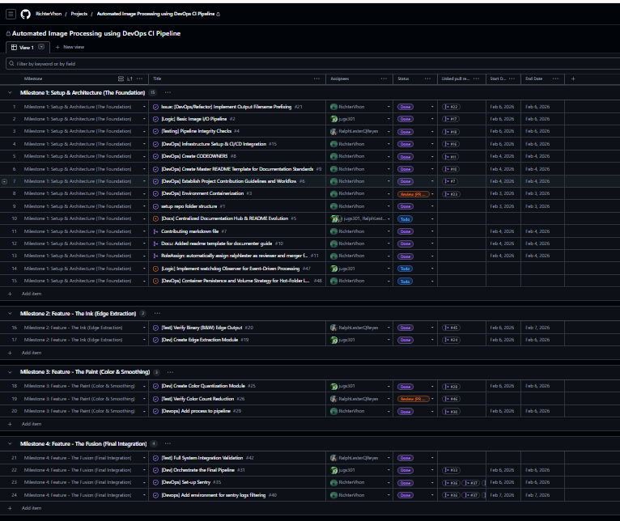
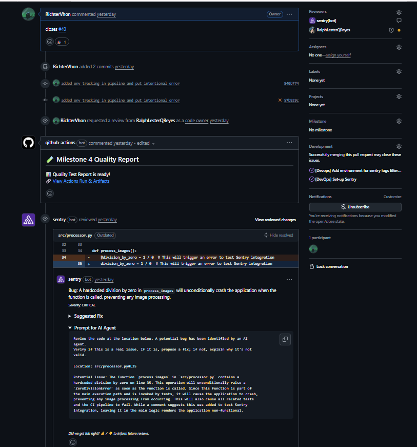
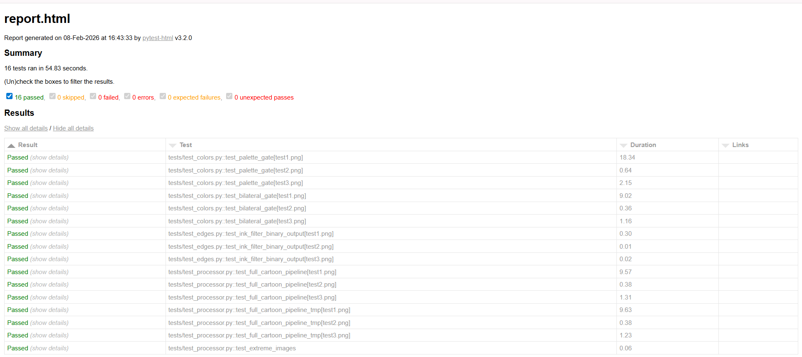
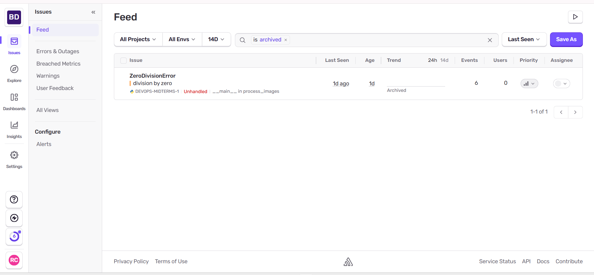

# [DevOps Midterm - Image Sketcher/Cartoonizer]

> Automated Image Processing using DevOps CI Pipeline

> **Requirements:** Python 3 | OpenCV | GitHub & GitHub Actions | PyTest

## 📝 Project Overview (**vhon, done**)

This project is an automated batch image processing system. It is designed to monitor an input directory, detect image files, apply complex transformations using **OpenCV**, and save the results to a structured output directory. The system utilizes **Pytest** within a **GitHub Actions CI/CD pipeline** to automatically validate logic and trigger deployments to the **GitHub Container Registry** upon every successful build. This end-to-end automation, combined with **Sentry** for real-time error tracking, ensures that the most recent, verified version of the service is always ready for production use.

## 🚦 Status & Traceability Matrix (System Requirements) (**kier**)

> **Documenter Source:** *Project Board "Done" Column + Merged Pull Requests.*

| ID | System Requirement | Status | Verification (Link) |
| --- | --- | --- | --- |
| **REQ-01** | Auto-detect images in input directory | ✅ DONE | [Issue #47](https://github.com/RichterVhon/devops-midterm/issues/47) [PR #17](https://github.com/RichterVhon/devops-midterm/pull/17) |
| **REQ-02** | Apply 2+ OpenCV techniques | ✅ DONE | [PR #24 – Edge Detection](https://github.com/RichterVhon/devops-midterm/pull/24) [PR #28 – Color Quantization](https://github.com/RichterVhon/devops-midterm/pull/28) |
| **REQ-03** | Save to output directory | ✅ DONE | [PR #22 – Output Handling](https://github.com/RichterVhon/devops-midterm/pull/22) |
| **REQ-04** | GitHub Actions Pipeline (Run on Push) | ✅ DONE | [PR #16](https://github.com/RichterVhon/devops-midterm/pull/16) + [PR #18](https://github.com/RichterVhon/devops-midterm/pull/18) + [PR #30](https://github.com/RichterVhon/devops-midterm/pull/30) + [PR #11](https://github.com/RichterVhon/devops-midterm/pull/11) |

---

## ⭐ Key Features (**vhon, done**)

* **Automated Batch Processing**: A high-performance **OpenCV** pipeline that scans `/input` for supported formats and applies a multi-stage "Logic Sandwich" (Edge Detection + K-Means Color Quantization).
* **Event-Driven Execution**: Configured with a **File System Observer** that eliminates manual execution; the service reactively processes images the moment they are detected in the mounted volume.
* **Infrastructure as Code (Docker)**: Fully containerized environment using **Docker Buildx** and **GHCR** (GitHub Container Registry) for consistent, reproducible execution across any platform.
* **Two-Tier CI/CD Pipeline**: Automated **Flake8** linting for code quality and **Pytest** for logic verification, triggered on every push via **GitHub Actions**.
* **Automated Quality Reporting**: Generates **HTML Test Reports** as build artifacts and automatically posts quality summaries directly to Pull Request comments.
* **Security & Compliance**: Integrated **Trivy** vulnerability scanner that audits the final container for High/Critical security risks during the build process.
* **Post-Deployment Observability**: Integrated **Sentry** for real-time error tracking, utilizing release mapping and environment tagging to monitor the service in production.

---

# 🚀 Cartoonizer Service: Quick Start Guide

This guide provides the instructions to run the Image Watcher service. The service automatically detects images in a folder and applies a cartoon "ink and paint" effect using a Dockerized environment.

---

## 👤 For Users

> [!IMPORTANT]
> **Prerequisites:**
> 1. **Docker Desktop** must be installed and actively running.
> 2. **Folder Setup:** Create a folder named `pets` and a folder named `processed_pets` in your current directory before starting.

### 1. Pull the Image
```cmd
docker pull ghcr.io/richtervhon/devops-midterm:latest
```
### 2. Run the Service

Paste one of these one-line commands into your Windows Command Prompt (CMD).

**Option A: With Sentry Monitoring (Production mode)**
```cmd
docker run -it --rm -e SENTRY_DSN=<your_sentry_dsn> -e APP_ENV="production" -v "%cd%\your_output_folder":/app/input -v "%cd%\your_input_folder":/app/output ghcr.io/richtervhon/devops-midterm:latest
```

**Option B: With Sentry Monitoring (Production mode)**
```cmd
docker run -it --rm -e APP_ENV="local" -v "%cd%\your_input_folder":/app/input -v "%cd%\your_output_folder":/app/output ghcr.io/richtervhon/devops-midterm:latest
```
### 📝 Operational Notes

* **Stopping the Service:** To stop the watcher and exit the container, press **Ctrl + C**.
* **Pathing (%cd%):** The `%cd%` variable maps your current directory to the container. If you are using **PowerShell**, replace `%cd%` with `${PWD}`.
* **Polling Mode:** The service scans for new files every 1 second to ensure the Windows-to-Linux volume mount detects changes immediately.

*This maps your current directory to the container to see results locally.*

### 💻 For Developers (Setup Environment)

1. **Clone the Repository:** 
```bash
git clone https://github.com/RichterVhon/devops-midterm
cd devops-midterm
```
2. **Setup Virtual Environment: It is recommended to use a virtual environment to manage dependencies:** 
```bash
python -m venv venv
.\venv\Scripts\activate
```

3. **Install Dependencies: Install the core processing libraries and testing tools:**
```bash
pip install -r requirements.txt
pip install pytest
```

4. **Run the Watcher Service: To test the file monitoring logic locally without Docker, run:**
```bash
python src/watcher.py
```
5. **Execute Tests: Run the test suite to verify the cartoonization gates and edge detection logic:**
```bash
pytest
```

---

## 🛠 Technical Architecture & Logic

### ⚙️ DevOps & Observability Workflow (**vhon, done**)
**Lead Architect:** vhon | **Configuration Path:** [`.github/workflows/pipeline.yml`](.github/workflows/pipeline.yml)

The project implements a comprehensive **CI/CD/CO** (Continuous Integration, Deployment, and Observation) pipeline to ensure systemic reliability and security. This automation ensures that every code change is validated before reaching the production environment.

* **Continuous Integration (CI)**: 
    * **Linting**: Automatically runs **Flake8** to enforce PEP8 coding standards across all `.py` files.
    * **Logic Validation**: Executes the **Pytest** suite inside the build container to verify OpenCV filter math and image handling logic.
* **Security & Distribution (CD)**:
    * **Vulnerability Scanning**: Integrates **Trivy** to audit the Docker image for High/Critical security risks during the build phase.
    * **Container Registry**: Automatically builds and pushes the verified image to **GHCR** (GitHub Container Registry) upon successful testing.
* **Continuous Observation (CO)**:
    * **Real-time Monitoring**: Utilizes **Sentry** integration to capture runtime exceptions and performance bottlenecks during the persistent "Hot-Folder" loop.
    * **Traceability**: Links every production error to a specific commit via `GITHUB_SHA` tagging, enabling rapid debugging.


### 🧩 Image Processing Logic (**franco**; include file path and specific files, katulad nung ginawa ko sa devops & observability workflow)

The core engine utilizes **OpenCV (cv2)** following this logic:

1. **Ingestion**: Scans the input directory for valid file signatures.
2. **Transformation**:
* **Grayscale**: Converts BGR to single-channel luminosity.
* **Edge Detection**: Uses the **Sobel Operator** to calculate intensity gradients, identifying object boundaries.
3. **Export**: Saves the processed array to the `/output` folder with timestamped filenames.

### 🧪 Quality Assurance (Automated Testing) (**Saige**:)
**Testing:** Ralph (saige) | **Test Directory** [`tests/`](tests/)
> **Documenter Source:** *PyTest terminal logs and GitHub Actions history*

The system ensures reliability through PyTest. Automated tests verify the full lifecycle of an image from the `input/` folder to the final `output/` directory, ensuring no data is lost or corrupted during the transformation.

* **Detection & I/O Success**: 
    * **File discovery**: Automatically verifies the correct identification and staging of image files from the `input/` folder.
    * **Write Permissions**: Confirms the system’s ability to generate and write to the `output/processed/`, `.debug_masks/`, and `paint/` subdirectories.
    * **File location**: `tests/test_processor.py`
* **Integrity**:
    * **Dimensional Accuracy**: Enforces a strict match between the original and processed images to prevent unintended resizing or aspect ratio distortion.
    * **Corruption Gate**: Utilizes `cv2.imread()` validation to ensure processed files are readable and not corrupted during the "Cartoon Machine" execution.
    * **File location**: `tests/test_processor.py`
* **Filter Logic Validation**: 
    * **Ink Gate (Edges)**: Verifies that the edge extraction produces a strict binary output `(0 or 255)` using `tests/test_edges.py.`
    * **Palette Gate (Colors)**: Validates that `K-Means quantization` successfully reduces color complexity without losing image detail via `tests/test_colors.py`
* **Resilience Testing**: 
    * **Stress Testing**: Executes a "Crash-Test" using extreme inputs (100% black and 100% white images) to ensure the OpenCV compute engine remains stable under non-standard lighting conditions.

### 📂 Project Structure (**vhon, done**)

A modular hierarchy designed for scalability, clear separation of concerns, and automated testing.

* **`.github/`**:
    * **`workflows/pipeline.yml`**: The engine for CI/CD, linting, and security audits.
    * **`CODEOWNERS`**: Defines ownership and required reviewers for specific directories to maintain quality control.
* **`docs/`**: Centralized documentation hub.
    * **`screenshots/`**: Dedicated storage for visual verification logs used in Pull Request "Proof of Work" documentation.
    * **`CONTRIBUTING.md`**: The definitive guide for project standards, commit formats, and "No Issue, No Work" policies.
    * **`README_TEMPLATE.md`**: A standardized template to ensure consistent documentation across related modules.
* **`src/`**: The application source code.
    * **`filters/`**: Modular OpenCV logic, separated into `edges.py` (detection) and `colors.py` (quantization).
    * **`processor.py`**: The orchestration layer that applies the "Logic Sandwich" to image data.
    * **`watcher.py`**: The "Driver" service utilizing `watchdog` for real-time `/input` directory monitoring and event triggering.
* **`tests/`**: A comprehensive **Pytest** suite ensuring logic integrity.
    * **`assets/`**: Standardized image files (`test1.png`, `test2.png`, etc.) used for regression testing and filter validation.
    * **`test_*.py`**: Specific test modules (e.g., `test_colors.py`, `test_edges.py`) for verifying mathematical and logic accuracy.
* **`input/` & `output/`**: Mounted volumes used by the Docker container for automated, event-driven image processing.
* **`Dockerfile`**: Defines the optimized Python 3.11-slim environment, dependencies, and service entry point.
* **`requirements.txt`**: Managed dependencies including **OpenCV**, **Watchdog**, and **Sentry-SDK**.
* **`.gitignore`**: Configured to exclude `__pycache__`, environment secrets, and local processing artifacts.

---

### 📸 Visual Gallery & File Proof (**Saige**)
**Visual Lead:** saige | **Asset Path:** [`docs/screenshots/`](docs/screenshots/)
> **Documenter Source:** *Tester's PR screenshots and Local File System logs*

This gallery demonstrates the complete transformation from the `Original Input` to the `Final Cartoon` Result by verifying our `Ink Gate (edges)` and `Paint Effect (colors)` milestones. These side-by-side results prove that the system successfully processes images while maintaining perfect geometric consistency as required.





### File System Proof



> **No Issue, No Work**: Proof of our live task flow. Every active feature is represented by an Issue, ensuring no "shadow code" enters the repository.

---

## 🤖 Automation & Workflow Verification (vhon, done)

This section provides visual evidence of the **Gatekeeper Protocol** in action, ensuring every Pull Request meets our rigorous standards for security, logic, and documentation.

### 1. Project Management & Traceability

#### A. Development Roadmap (Timeline)

> **Strategic Alignment**: A high-level view of our development phases, tracking the transition from Project Scaffolding to Core logic and integration.

#### B. GitHub Project Board (Kanban)

> **No Issue, No Work**: Proof of our live task flow. Every active feature is represented by an Issue, ensuring no "shadow code" enters the repository.

#### C. Sprint Table (Metadata View)

> **Accountability Matrix**: A data-driven view showing task owners (Lead Dev, DevOps, etc.), priority levels, and linked Pull Requests for every milestone.

---

### 2. CI/CD Pipeline (GitHub Actions)

> **Proof of Quality**: Evidence of the `pipeline.yml` successfully executing Flake8 linting, Pytest suites, and Trivy security scans before allowing a merge.

### 3. Automated PR Feedback (Gitbot & SEER)


> **Interactive Governance**: Automated feedback from SEER for code analysis and Gitbot for HTML/Documentation previews, ensuring consistency across all contributors.

### 4. Real-time Monitoring (Sentry)

> **Error Traceability**: Verification of Sentry integration, capturing and logging runtime exceptions during the "Hot-Folder" processing cycle.

---

## 📈 Process Evolution (Workflow & Documentation) (**done**)
**Lead Architect:** vhon | **Strategy:** Industry-Standard SDLC

We implemented advanced **Industry Workflows** to maintain high velocity without sacrificing code quality. Our process is built on a "No Issue, No Work" foundation, ensuring every line of code serves a documented purpose.

### 📋 Project Management & Traceability
* **"No Issue, No Work" Policy**: Development is strictly demand-driven. No code is authored or merged unless it addresses a pre-existing, documented **Issue**.
* **Mandatory PR Linking**: Every Pull Request must be linked to one or more specific Issues using GitHub's linking keywords (e.g., `Closes #12`). This creates a permanent, searchable audit trail.
* **Granular Organization**:
    * **Tags & Labels**: Issues utilize a multi-tag system (e.g., `critical`, `feature`, `documentation`) for efficient filtering and priority management.
    * **Clear Ownership**: Every Issue is assigned to a specific collaborator, ensuring clear accountability for every project component.
* **Automated Progress Tracking**: By leveraging **GitHub Projects (V2)**, version history and progress tracking are automated. This serves as the "Single Source of Truth" for stakeholders to view real-time status without manual reporting. The table, board, and roadmap are actively maintained for easier documentation. 


### 🖊️ Governance & Standardization
* **Standardized Formatting**:
    * **Commit Messages**: We follow a strict prefix-based convention (e.g., `feat:`, `fix:`, `refactor:`, `docs:`) to maintain a readable and professional Git history.
    * **PR Titles**: Titles must follow standardized naming conventions to facilitate easy auditing during release cycles.
* **The Contributor's Guide**: A [**`CONTRIBUTING.md`**](./docs/CONTRIBUTING.md) was created to onboard collaborators and enforce standards regarding branching strategies, coding styles, and submission protocols.
* **Visual Proof of Work**: All PR descriptions are required to include **screenshots or terminal logs** as evidence that the implementation was verified in a local environment prior to submission.


### 🛡️ Quality & Gatekeeper Protocols
* **Gatekeeper Protocol**: A strict **"No Direct Push"** policy is enforced on the `main` branch to protect the production-ready code. This is enforced by branch protection settings and setting of [**CODEOWNERS**] file inside .github/ directory.
* **Automated Logic Validation**: Our **GitHub Actions** CI suite serves as an automated gatekeeper, running Linter and Pytest checks on every push. Merges are blocked unless all status checks pass.
* **Zero Documentation Debt**: The **Traceability Matrix** within this README is manually synced post-merge to ensure the documentation reflects the exact state of the project board.

---

### 📂 Governance Resources
| File / Resource | Location | Purpose |
| :--- | :--- | :--- |
| **Contributor Guide** | [`CONTRIBUTING.md`](./docs/CONTRIBUTING.md) | Standardized commit, PR, and coding formats. |
| **CODEOWNERS** | [`.github/CODEOWNERS`](./.github/CODEOWENERS) | Automated assignment of code tester, reviewer, and validator of PRs to main branch. |
| **Project Table** | [Live Project Board](https://github.com/users/RichterVhon/projects/1/views/1?layout=board) | Automated tracking of milestones, tags, and assignees. |

---

## 📜 Version History (Changelog) (**kier**; extract table from projects table (.tsv file), copy paste contents of tsv file, go to https://www.tablesgenerator.com/markdown_tables, file->paste table data, load. then copy paste mo yung lalabas na table dun sa baba). palitan mo nalang yung ppaste ko sa baba, pag done na lahat

| Milestone 	| Title 	| URL 	| Assignees 	| Status 	| Linked pull requests 	| Start Date 	| End Date 	|
|---	|---	|---	|---	|---	|---	|---	|---	|
| Milestone 1: Setup & Architecture (The Foundation) 	| Issue: [DevOps/Refactor] Implement Output Filename Prefixing 	| https://github.com/RichterVhon/devops-midterm/issues/21 	| RichterVhon 	| Done 	| https://github.com/RichterVhon/devops-midterm/pull/22 	| Feb 6, 2026 	| Feb 6, 2026 	|
| Milestone 1: Setup & Architecture (The Foundation) 	| [Logic] Basic Image I/O Pipeline 	| https://github.com/RichterVhon/devops-midterm/issues/2 	| jugs301 	| Done 	| https://github.com/RichterVhon/devops-midterm/pull/17 	| Feb 6, 2026 	| Feb 6, 2026 	|
| Milestone 1: Setup & Architecture (The Foundation) 	| [Testing] Pipeline Integrity Checks 	| https://github.com/RichterVhon/devops-midterm/issues/4 	| RalphLesterQReyes 	| Done 	| https://github.com/RichterVhon/devops-midterm/pull/18 	| Feb 6, 2026 	| Feb 6, 2026 	|
| Milestone 1: Setup & Architecture (The Foundation) 	| [DevOps] Infrastructure Setup & CI/CD Integration 	| https://github.com/RichterVhon/devops-midterm/issues/15 	| RichterVhon 	| Done 	| https://github.com/RichterVhon/devops-midterm/pull/16 	| Feb 6, 2026 	| Feb 6, 2026 	|
| Milestone 1: Setup & Architecture (The Foundation) 	| [DevOps] Create CODEOWNERS 	| https://github.com/RichterVhon/devops-midterm/issues/8 	| RichterVhon 	| Done 	| https://github.com/RichterVhon/devops-midterm/pull/11 	| Feb 4, 2026 	| Feb 4, 2026 	|
| Milestone 1: Setup & Architecture (The Foundation) 	| [DevOps] Create Master README Template for Documentation Standards 	| https://github.com/RichterVhon/devops-midterm/issues/9 	| RichterVhon 	| Done 	| https://github.com/RichterVhon/devops-midterm/pull/10 	| Feb 4, 2026 	| Feb 4, 2026 	|
| Milestone 1: Setup & Architecture (The Foundation) 	| [DevOps] Establish Project Contribution Guidelines and Workflow 	| https://github.com/RichterVhon/devops-midterm/issues/6 	| RichterVhon 	| Done 	| https://github.com/RichterVhon/devops-midterm/pull/7 	| Feb 4, 2026 	| Feb 4, 2026 	|
| Milestone 1: Setup & Architecture (The Foundation) 	| [DevOps] Environment Containerization 	| https://github.com/RichterVhon/devops-midterm/issues/3 	| RichterVhon 	| Review (PR Opened) 	| https://github.com/RichterVhon/devops-midterm/pull/23 	| Feb 3, 2026 	| Feb 3, 2026 	|
| Milestone 1: Setup & Architecture (The Foundation) 	| setup repo folder structure 	| https://github.com/RichterVhon/devops-midterm/issues/1 	| RichterVhon 	| Done 	|  	| Feb 3, 2026 	| Feb 3, 2026 	|
| Milestone 1: Setup & Architecture (The Foundation) 	| [Docs] Centralized Documentation Hub & README Evolution 	| https://github.com/RichterVhon/devops-midterm/issues/5 	| jugs301, RalphLesterQReyes, RichterVhon, xelarkkk 	| Todo 	|  	|  	|  	|
| Milestone 1: Setup & Architecture (The Foundation) 	| Contributing markdown file 	| https://github.com/RichterVhon/devops-midterm/pull/7 	| RichterVhon 	| Done 	|  	| Feb 4, 2026 	| Feb 4, 2026 	|
| Milestone 1: Setup & Architecture (The Foundation) 	| Docu: Added readme template for documenter guide 	| https://github.com/RichterVhon/devops-midterm/pull/10 	| RichterVhon 	| Done 	|  	| Feb 4, 2026 	| Feb 4, 2026 	|
| Milestone 1: Setup & Architecture (The Foundation) 	| RoleAssign: automatically assign ralphlester as reviewer and merger f… 	| https://github.com/RichterVhon/devops-midterm/pull/11 	| RichterVhon 	| Done 	|  	| Feb 4, 2026 	| Feb 4, 2026 	|
| Milestone 1: Setup & Architecture (The Foundation) 	| [Logic] Implement watchdog Observer for Event-Driven Processing 	| https://github.com/RichterVhon/devops-midterm/issues/47 	| jugs301 	| Todo 	|  	|  	|  	|
| Milestone 1: Setup & Architecture (The Foundation) 	| [DevOps] Container Persistence and Volume Strategy for Hot-Folder Logic 	| https://github.com/RichterVhon/devops-midterm/issues/48 	| RichterVhon 	| Todo 	|  	|  	|  	|
| Milestone 2: Feature - The Ink (Edge Extraction) 	| [Test] Verify Binary (B&W) Edge Output 	| https://github.com/RichterVhon/devops-midterm/issues/20 	| RalphLesterQReyes 	| Done 	| https://github.com/RichterVhon/devops-midterm/pull/45 	| Feb 6, 2026 	| Feb 7, 2026 	|
| Milestone 2: Feature - The Ink (Edge Extraction) 	| [Dev] Create Edge Extraction Module 	| https://github.com/RichterVhon/devops-midterm/issues/19 	| jugs301 	| Done 	| https://github.com/RichterVhon/devops-midterm/pull/24 	| Feb 6, 2026 	| Feb 6, 2026 	|
| Milestone 3: Feature - The Paint (Color & Smoothing) 	| [Dev] Create Color Quantization Module 	| https://github.com/RichterVhon/devops-midterm/issues/25 	| jugs301 	| Done 	| https://github.com/RichterVhon/devops-midterm/pull/28 	| Feb 6, 2026 	| Feb 6, 2026 	|
| Milestone 3: Feature - The Paint (Color & Smoothing) 	| [Test] Verify Color Count Reduction 	| https://github.com/RichterVhon/devops-midterm/issues/26 	| RalphLesterQReyes 	| Review (PR Opened) 	| https://github.com/RichterVhon/devops-midterm/pull/46 	|  	|  	|
| Milestone 3: Feature - The Paint (Color & Smoothing) 	| [Devops]  Add process to pipeline 	| https://github.com/RichterVhon/devops-midterm/issues/29 	| RichterVhon 	| Done 	| https://github.com/RichterVhon/devops-midterm/pull/30 	| Feb 6, 2026 	| Feb 6, 2026 	|
| Milestone 4: Feature - The Fusion (Final Integration) 	| [Test] Full System Integration Validation 	| https://github.com/RichterVhon/devops-midterm/issues/42 	| RalphLesterQReyes 	| Done 	|  	|  	|  	|
| Milestone 4: Feature - The Fusion (Final Integration) 	| [Dev] Orchestrate the Final Pipeline 	| https://github.com/RichterVhon/devops-midterm/issues/31 	| jugs301 	| Done 	| https://github.com/RichterVhon/devops-midterm/pull/33 	| Feb 6, 2026 	| Feb 6, 2026 	|
| Milestone 4: Feature - The Fusion (Final Integration) 	| [DevOps] Set-up Sentry 	| https://github.com/RichterVhon/devops-midterm/issues/35 	| RichterVhon 	| Done 	| https://github.com/RichterVhon/devops-midterm/pull/36, https://github.com/RichterVhon/devops-midterm/pull/37, https://github.com/RichterVhon/devops-midterm/pull/39, https://github.com/RichterVhon/devops-midterm/pull/41 	| Feb 6, 2026 	| Feb 6, 2026 	|
| Milestone 4: Feature - The Fusion (Final Integration) 	| [Devops] Add environment for sentry logs filtering 	| https://github.com/RichterVhon/devops-midterm/issues/40 	| RichterVhon 	| Done 	| https://github.com/RichterVhon/devops-midterm/pull/36, https://github.com/RichterVhon/devops-midterm/pull/37, https://github.com/RichterVhon/devops-midterm/pull/41 	| Feb 7, 2026 	| Feb 7, 2026 	|
---

## 👥 The Team
**Strategy:** Role-Based Accountability

The project is structured into four specialized domains to ensure parallel development, modularity, and rigorous quality control. Each member owns a specific sector of the repository and the project board.

| Role | Name | GitHub | Responsibility | Primary Deliverables | Key Tools |
| :--- | :--- | :--- | :--- | :--- | :--- |
| **Lead Developer** | Carlo, John Franco | [@jugs301](https://github.com/jugs301) | Algorithm Design & Core Logic | `src/filters/`, `src/processor.py` | OpenCV, NumPy |
| **Tester** | Reyes, Ralph Lester | [@RalphLesterQReyes](https://github.com/RalphLesterQReyes) | Validation & Quality Assurance | `tests/`, Bug Reports, PR Approval | Pytest, Manual Logs |
| **DevOps** | Dela Cruz, Richter Vhon C. | [@RichterVhon](https://github.com/RichterVhon) | Infrastructure & Automation | `pipeline.yml`, `Dockerfile`, `CONTRIBUTING.md` | GH Actions, Sentry, Docker, Trivy |
| **Documenter** | Leonardo, Kier Paolo | [@xelarkkk](https://github.com/xelarkkk) | Traceability & Knowledge Base | `README.md`, Visual Gallery | Markdown, Project Boards |

---
